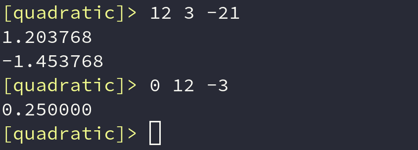

# Quadratic

     

A minimalistic CLI Linux program which solves quadratic equations.

* [Description](#description)
* [Installation](#installation)
* [Usage](#usage)

## Description
This program can easily solve quadratic equations. It has an **eye-catching design** and **user-friendly interface**.

## Installation
This program can be installed in a few simple steps. You should have `git` , `make` and `g++ compiler` installed.
* Clone this repository:
    * `git clone https://github.com/d3phys/Quadratic.git`
 * Build the program:
    * `cd Quadratic/`
    * `make bin`

## Usage
Run  `./quadratic.out` and enjoy the process.

**"Quadratic"** works with a standard form quadratic equation:
`ax²+bx+c=0`. Simply enter `a` `b` `c` coefficients.

>You can enter `0` instead of `a` to solve a linear equation.

     

